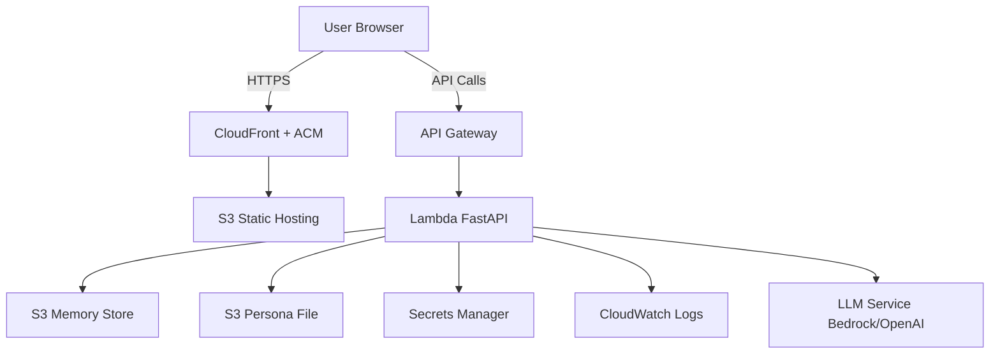

# Design Document

## Overview

The Digital Twin Chat Application is a full-stack serverless solution that provides an AI-powered conversational interface mimicking a user's persona. The system consists of a Next.js frontend deployed to S3/CloudFront, a FastAPI backend running on AWS Lambda, and persistent memory storage in S3. The architecture emphasizes security, scalability, and production-grade operational practices.

## Architecture

### High-Level Architecture



### Deployment Architecture

**Frontend (Next.js)**
- Built as static export using Next.js App Router
- Deployed to S3 bucket with static website hosting
- Distributed via CloudFront with custom domain
- HTTPS enforced via ACM certificate

**Backend (FastAPI)**
- Packaged as Lambda function with Lambda Web Adapter or Mangum
- Exposed via API Gateway HTTP API
- Accesses S3 for memory and persona file
- Retrieves secrets from Secrets Manager
- Logs to CloudWatch

**Local Development**
- Next.js dev server on localhost:3000
- FastAPI with uvicorn on localhost:8000
- Local filesystem for persona file
- Local JSON file or in-memory store for conversation history

## Components and Interfaces

### Frontend Components

**1. Chat Interface Component**
- Displays conversation history with message bubbles
- Input field for user messages
- Send button and keyboard shortcuts
- Loading states during API calls
- Optional streaming support with progressive rendering

**2. API Client Service**
- Handles HTTP requests to FastAPI backend
- Manages authentication tokens if needed
- Implements retry logic and error handling
- Supports both standard and streaming responses

**3. Session Management**
- Generates or retrieves session ID for conversation continuity
- Stores session ID in localStorage or cookies
- Passes session ID with each API request

### Backend Components

**1. FastAPI Application**
- REST endpoints for chat operations
- Request validation using Pydantic models
- Error handling middleware
- CORS configuration for frontend origin

**2. Persona Loader**
- Reads me.txt from S3 or local filesystem
- Caches persona content in memory
- Handles missing or malformed persona files
- Provides persona text for LLM context injection

**3. Memory Manager**
- Stores conversation messages to S3
- Retrieves conversation history by session ID
- Implements efficient serialization (JSON)
- Manages conversation context window limits

**4. LLM Client**
- Integrates with LLM service (AWS Bedrock or OpenAI)
- Constructs prompts with persona and conversation history
- Handles streaming and non-streaming responses
- Implements token counting and context management

**5. Secrets Manager Client**
- Retrieves API keys and credentials at runtime
- Caches secrets with TTL to reduce API calls
- Handles secret rotation gracefully

### API Endpoints

**POST /api/chat**
- Request: `{ "message": "string", "session_id": "string" }`
- Response: `{ "response": "string", "session_id": "string" }`
- Processes user message and returns Digital Twin response

**GET /api/chat/history/{session_id}**
- Response: `{ "messages": [{"role": "user|assistant", "content": "string", "timestamp": "ISO8601"}] }`
- Retrieves conversation history for a session

**GET /api/health**
- Response: `{ "status": "healthy", "version": "string" }`
- Health check endpoint for monitoring

## Data Models

### Message Model
```python
class Message:
    role: str  # "user" or "assistant"
    content: str
    timestamp: datetime
    session_id: str
```

### Conversation Model
```python
class Conversation:
    session_id: str
    messages: List[Message]
    created_at: datetime
    updated_at: datetime
```

### Chat Request Model
```python
class ChatRequest:
    message: str
    session_id: Optional[str]
    stream: bool = False
```

### Chat Response Model
```python
class ChatResponse:
    response: str
    session_id: str
    timestamp: datetime
```

## Correctness Properties

*A property is a characteristic or behavior that should hold true across all valid executions of a system—essentially, a formal statement about what the system should do. Properties serve as the bridge between human-readable specifications and machine-verifiable correctness guarantees.*

### Property 1: Message storage and retrieval preserves content
*For any* valid message sent through the chat system, storing it to the memory store and then retrieving the conversation history should return that message with identical content, organized by session ID, in chronological order.
**Validates: Requirements 2.1, 2.4, 2.5**

### Property 2: Persona content always included in LLM context
*For any* chat request, the LLM prompt constructed by the system should contain the complete text content from the persona file (me.txt), either prepended or injected into the prompt.
**Validates: Requirements 1.2, 3.4**

### Property 3: Conversation history included in context
*For any* chat request with existing conversation history, the LLM context should include all previous messages from that session in chronological order.
**Validates: Requirements 2.3, 2.5**

### Property 4: HTTPS enforcement for all requests
*For any* HTTP request to the production system (frontend or API), the system should either redirect to HTTPS or reject the request, ensuring all communications use encrypted transport.
**Validates: Requirements 5.3, 5.4**

### Property 5: IAM policies follow least privilege
*For any* IAM role or policy in the system, the permissions should specify exact resource ARNs (no wildcards), include only necessary actions, and grant minimum required access for the component to function.
**Validates: Requirements 6.1, 6.2, 6.3, 6.5**

### Property 6: All errors produce structured logs
*For any* error or exception that occurs in the Lambda function, a structured JSON log entry should be written to CloudWatch containing the error message, stack trace, request context, and correlation ID.
**Validates: Requirements 7.1, 7.2, 7.3**

### Property 7: Secrets retrieved from Secrets Manager
*For any* API key or credential required by the application, the retrieval should occur through AWS Secrets Manager using IAM authentication and TLS encryption, never from environment variables, configuration files, or hardcoded values.
**Validates: Requirements 9.1, 9.2, 9.4**

## Error Handling

### Frontend Error Handling
- Network errors: Display user-friendly message with retry option
- Timeout errors: Show loading state with timeout notification
- Invalid responses: Log error and display generic error message
- Session errors: Clear local session and start new conversation

### Backend Error Handling
- Missing persona file: Return 500 with specific error, log warning
- S3 access errors: Retry with exponential backoff, fallback to empty history
- LLM API errors: Return 503 with retry-after header
- Invalid request data: Return 400 with validation error details
- Secrets Manager errors: Fail fast with clear error message

### Infrastructure Error Handling
- Lambda timeout: Set appropriate timeout (30s for chat, 5s for health)
- Lambda memory: Configure sufficient memory (512MB-1GB)
- API Gateway throttling: Implement rate limiting and return 429
- CloudFront errors: Configure custom error pages

## Testing Strategy

### Unit Testing

**Frontend Unit Tests**
- Test chat component rendering with various message states
- Test API client request/response handling
- Test session ID generation and storage
- Test error state rendering

**Backend Unit Tests**
- Test FastAPI endpoint request validation
- Test persona loader with valid and missing files
- Test memory manager serialization/deserialization
- Test LLM client prompt construction
- Test secrets manager client caching logic

### Property-Based Testing

The system will use **Hypothesis** (Python) for backend property-based testing and **fast-check** (TypeScript) for frontend property-based testing where applicable.

Each property-based test will run a minimum of 100 iterations to ensure comprehensive coverage across the input space.

**Backend Property Tests**
- Property 1: Generate random messages, store to mock S3, retrieve and verify content matches
- Property 2: Generate random persona content, verify it appears in constructed LLM prompts
- Property 3: Generate random conversation histories, verify chronological order maintained in context
- Property 8: Verify all secret retrievals use Secrets Manager client, never direct env vars

**Frontend Property Tests**
- Property 4: Generate random messages, verify local and production API clients produce equivalent requests

### Integration Testing

**Local Integration Tests**
- Start local FastAPI server and Next.js dev server
- Send test messages and verify responses
- Verify conversation history persists across requests
- Verify persona content influences responses

**AWS Integration Tests**
- Deploy to staging environment
- Test end-to-end message flow through API Gateway and Lambda
- Verify S3 memory persistence
- Verify CloudWatch logs are written
- Verify secrets are retrieved from Secrets Manager

### Test Plan for Key Requirements

**Memory Persistence Test**
1. Send message A to chat endpoint with new session
2. Verify message A stored in S3 at correct path
3. Send message B to same session
4. Retrieve conversation history
5. Assert both messages A and B present in chronological order

**Persona Loading Test**
1. Create test persona file with unique marker text
2. Upload to S3 or place in local backend/me.txt
3. Send chat message
4. Capture LLM prompt (via logging or mock)
5. Assert marker text from persona file present in prompt

**Conversation Continuity Test**
1. Start new session, send message "My name is Alice"
2. Send follow-up message "What is my name?"
3. Verify response references "Alice"
4. Verify conversation history includes both messages in context

**Local vs Production Equivalence Test**
1. Configure identical persona file in both environments
2. Send same message to local and production endpoints
3. Verify both responses include persona characteristics
4. Verify both store messages to their respective storage backends

## Infrastructure as Code

### Deployment Tools
- **AWS CDK** or **Terraform** for infrastructure provisioning
- **GitHub Actions** or **AWS CodePipeline** for CI/CD
- **Docker** for Lambda packaging (optional, for dependencies)

### Resource Definitions

**S3 Buckets**
- Frontend static hosting bucket with CloudFront OAI
- Memory store bucket with versioning enabled
- Persona file bucket (or same as memory store)

**Lambda Function**
- Runtime: Python 3.11+
- Handler: FastAPI with Mangum adapter
- Memory: 512MB-1GB
- Timeout: 30 seconds
- Environment variables: ENVIRONMENT, S3_MEMORY_BUCKET, S3_PERSONA_BUCKET

**API Gateway**
- HTTP API (lower cost, simpler than REST API)
- CORS configuration for frontend domain
- Custom domain with ACM certificate
- Throttling: 1000 requests/second

**CloudFront Distribution**
- Origin: S3 static hosting bucket
- Custom domain with ACM certificate
- Cache behavior: Cache static assets, no-cache for index.html
- HTTPS only with TLS 1.2 minimum

**IAM Roles**
- Lambda execution role with policies for:
  - CloudWatch Logs write
  - S3 read/write to memory and persona buckets
  - Secrets Manager read for specific secrets
  - Bedrock InvokeModel (if using Bedrock)

**Secrets Manager**
- Secret for LLM API key (OpenAI or other)
- Automatic rotation configuration (optional)

**CloudWatch**
- Log groups for Lambda functions
- Metric alarms for error rates and latency
- Dashboard for system health visualization

## Security Considerations

- All S3 buckets use encryption at rest (SSE-S3 or SSE-KMS)
- API Gateway uses AWS WAF for DDoS protection (optional)
- Lambda functions run in VPC if accessing private resources (optional)
- Secrets Manager uses KMS encryption
- CloudFront uses TLS 1.2+ only
- CORS restricted to specific frontend domain
- Input validation on all API endpoints
- Rate limiting on API Gateway

## Monitoring and Observability

**Key Metrics**
- Lambda invocation count, duration, errors
- API Gateway request count, 4xx/5xx errors, latency
- S3 request count and error rates
- LLM API latency and token usage

**Alarms**
- Lambda error rate > 5%
- API Gateway 5xx error rate > 1%
- Lambda duration > 25 seconds (approaching timeout)
- S3 access errors

**Logging**
- Structured JSON logs with correlation IDs
- Log levels: DEBUG (local), INFO (staging), WARN/ERROR (production)
- Request/response logging with PII redaction
- Performance timing logs for each component

## Deployment Strategy

**Environments**
- Local: Developer machines with local services
- Staging: Full AWS deployment for testing
- Production: Full AWS deployment with monitoring

**CI/CD Pipeline**
1. Code push triggers pipeline
2. Run linting and unit tests
3. Build Next.js static export
4. Package Lambda function with dependencies
5. Deploy infrastructure to staging
6. Run integration tests against staging
7. Manual approval gate
8. Deploy to production
9. Run smoke tests
10. Rollback on failure

**Rollback Strategy**
- Lambda versioning with aliases
- CloudFormation/CDK stack rollback on failure
- S3 versioning for static assets
- Blue-green deployment for zero-downtime updates
