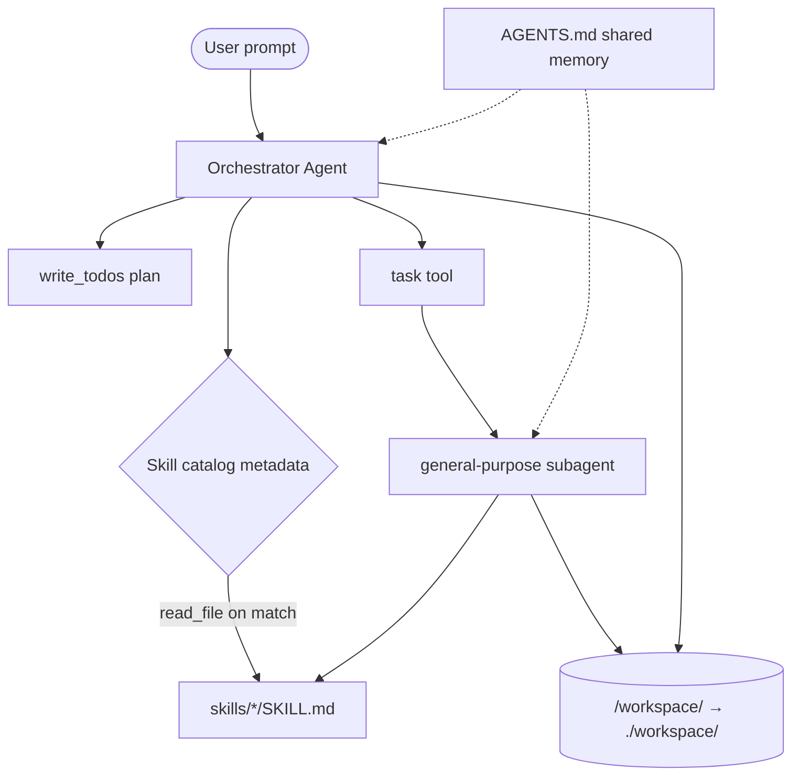

# Deep Agents with LangChain

<p align="center">
  
  
  
</p>

> A generic orchestrator + **SKILL.md** skills + **AGENTS.md** shared memory — autonomous agents that plan, delegate, and collaborate through the filesystem.

This project demonstrates the **Deep Agent** pattern from LangChain: no hardcoded specialist chains, no custom routers. The LLM discovers capabilities at runtime, loads skill playbooks on demand, and spawns subagents for multi-step work.

## Why this pattern?

| Shallow agent | Deep agent (this repo) |
|---------------|------------------------|
| Fixed tools baked into code | Skills added as folders — zero code changes |
| Single-thread reasoning | Planning + subagent delegation |
| Context only in chat history | Persistent handoffs in `/workspace/` (project `workspace/` folder) |
| Custom routing logic | LLM routes via skill **descriptions** |

## Architecture



### Four pillars in action

1. **Planning** — `write_todos` decomposes complex goals.
2. **Delegation** — `task` spawns isolated subagents with the same skill library.
3. **Progressive disclosure** — Only skill `name` + `description` load at startup; full `SKILL.md` loads when needed.
4. **Filesystem workspace** — Research, drafts, reviews, and deploy bundles pass between agents as files under `/workspace/` (mapped to `./workspace/` on disk).

## Project structure

```
deep-agents/
├── AGENTS.md                 # Shared team conventions (always loaded)
├── agent.py                  # Generic orchestrator factory
├── server.py                 # FastAPI backend + SSE streaming
├── frontend/                 # React + Tailwind professional UI
├── services/                 # Agent streaming + project data helpers
├── app.py                    # Legacy Streamlit UI (optional)
├── main.py                   # CLI runner
├── scripts/run.sh            # Build frontend + start server
├── skills/
│   ├── research/SKILL.md
│   ├── writer/SKILL.md
│   ├── code-reviewer/SKILL.md
│   └── static-deploy/SKILL.md
├── workspace/                # Agent artifacts (drafts, sites/, deploy_report_*.md)
├── runs/                     # Orchestration run history (auto-saved)
├── pyproject.toml
├── requirements.txt
└── .env.example
```

## Quick start

### Prerequisites

- Python 3.12+
- Node.js 20+ (for the React UI)
- [Anthropic](https://console.anthropic.com/) **or** [OpenAI](https://platform.openai.com/) API key
- [Tavily](https://tavily.com/) API key (for the research skill)

### Setup

```bash
cd langchain/deep-agents
python -m venv .venv
source .venv/bin/activate   # Windows: .venv\Scripts\activate
pip install -r requirements.txt
cp .env.example .env        # add your API keys
```

### Run (React UI — recommended)

**Production-style** (builds React, serves from FastAPI on one port):

```bash
chmod +x scripts/run.sh
./scripts/run.sh
```

Open `http://localhost:8000`.

**Development** (hot reload for UI):

```bash
# Terminal 1 — API
python server.py

# Terminal 2 — React dev server (proxies /api to :8000)
cd frontend && npm install && npm run dev
```

Open `http://localhost:5173`.

The UI includes:
- **Chat panel** with markdown rendering and suggested prompts
- **Orchestration pipeline** — plan → skills → subagents → workspace (with artifact diff)
- **Live activity feed** — thoughts, tool calls, skill loads, delegations, deploy events
- **Live site banner** — persistent Netlify URL from the latest `deploy_report_*.md`
- **Run history** — every chat saved under `./runs/{id}/` (replayable from sidebar)
- **Resizable sidebar** — drag the right edge on desktop to widen the Files tab
- **Sidebar tabs** — skills catalog, plan, workspace files, run history, AGENTS.md memory
- **Files tab** — auto-refreshes when agents write or deploy; full filenames wrap (no truncation)

### Run (Streamlit UI — legacy)

```bash
streamlit run app.py
```

Open `http://localhost:8501`.

### Run (CLI)

```bash
python main.py "Research LangGraph multi-agent patterns and draft a short blog post"
# or interactive mode:
python main.py
```

## Example prompts

Try these to see **research → writer** collaboration:

```
Research the impact of multi-agent systems on software engineering and draft a 500-word blog post.
```

```
Review agent.py for production readiness and save findings to the workspace.
```

```
Research current trends in agentic AI, write an executive summary, then review the draft for clarity.
```

```
Research multi-agent orchestration trends, draft a blog post, save it to the workspace, and deploy to a free cloud page.
```

Watch the UI for:

- **Skills tab** — metadata from each `SKILL.md`
- **Plan tab** — todos from `write_todos`
- **Files tab** — artifacts agents write for each other (`draft_*.md`, `sites/`, `deploy_report_*.md`)
- **Live activity** — real-time orchestration timeline (including deploy URL when live)
- **Green banner** — click-through link to the latest Netlify deploy

## How skill routing works

There is **no classifier**. `create_deep_agent(skills=["./skills"])` injects a catalog like:

```
Available skills:
- research: "Conducts comprehensive web research..."
- writer: "Writes high-quality blog posts..."
- code-reviewer: "Reviews code for bugs..."
- static-deploy: "Deploys to Netlify without asking..."
```

The model reads the user message, picks a skill, and calls `read_file("skills/research/SKILL.md")`. Well-written `description` fields (with trigger phrases and "Do NOT use for…" boundaries) are the routing engine.

## Workspace paths

Agents read and write artifacts using **virtual paths** like `/workspace/draft_topic.md`. The orchestrator uses `FilesystemBackend(root_dir=".", virtual_mode=True)` so those paths resolve to the project `./workspace/` folder — not the filesystem root `/workspace/`.

Predictable filenames (see `AGENTS.md`):

| Path | Purpose |
|------|---------|
| `/workspace/research_<topic>.md` | Research notes |
| `/workspace/draft_<topic>.md` | Blog drafts |
| `/workspace/review_<target>.md` | Review output |
| `/workspace/sites/<slug>/index.html` | Static site bundle |
| `/workspace/deploy_report_<slug>.md` | Deploy log + live URL |

## Autonomous deployment (no human-in-the-loop)

For prompts like *"research, write, and deploy to a free cloud page"*:

1. Agents **must not ask** which platform to use — default is **Netlify** (`static-deploy` skill).
2. The `deploy_static_site` tool converts markdown → HTML, saves under `workspace/sites/<slug>/`, and publishes to Netlify when configured.
3. **Conversation threads** (`thread_id`) keep follow-ups in the same task instead of starting over.
4. Deploy bundles include a Netlify `_headers` file so `index.html` is served as `text/html` (not plain text).

```
Research → write draft → deploy_static_site → live URL
```

### Netlify setup

1. Create a free account at [app.netlify.com](https://app.netlify.com).
2. Generate a **Personal Access Token**: [User settings → Applications → Personal access tokens](https://app.netlify.com/user/applications#personal-access-tokens).
3. Add to `.env`:

```env
NETLIFY_AUTH_TOKEN=nfp_xxxxxxxx
NETLIFY_SITE_ID=your-site-id   # optional — reuse same site on redeploy
DEPLOY_PLATFORM=netlify
```

Without `NETLIFY_AUTH_TOKEN`, the static bundle and `deploy_report_*.md` are still created locally; only the live publish is skipped.

After a successful deploy, find the URL in:

- The **green Live site banner** at the top of the UI
- The **Orchestration pipeline** / activity feed (deploy event)
- `workspace/deploy_report_<slug>.md` under **Files**

Redeploy after code changes: restart the server, then prompt e.g. *"Deploy `/workspace/draft_<topic>.md` to Netlify"* — set `NETLIFY_SITE_ID` to update the same site instead of creating a new one.

## Adding a new skill

1. Create `skills/my-skill/SKILL.md` with YAML frontmatter (`name`, `description`) and instructions.
2. Restart the app.
3. No changes to `agent.py` required.

See [agentskills.io](https://agentskills.io) for the full specification.

## Environment variables

| Variable | Required | Description |
|----------|----------|-------------|
| `ANTHROPIC_API_KEY` | One of Anthropic/OpenAI | Claude models |
| `OPENAI_API_KEY` | One of Anthropic/OpenAI | GPT models |
| `LLM_PROVIDER` | No | `auto`, `openai`, or `anthropic` (default `auto`) |
| `TAVILY_API_KEY` | For research | Web search tool |
| `WORKSPACE_ROOT` | No | Default `./workspace` |
| `RUNS_ROOT` | No | Default `./runs` (orchestration history) |
| `DEPLOY_PLATFORM` | No | Default `netlify` |
| `NETLIFY_AUTH_TOKEN` | For live deploy | Netlify personal access token ([how to create](https://app.netlify.com/user/applications#personal-access-tokens)) |
| `NETLIFY_SITE_ID` | No | Reuse existing Netlify site on redeploy (recommended) |
| `ANTHROPIC_MODEL` | No | Default `claude-sonnet-4-20250514` |
| `OPENAI_MODEL` | No | Default `gpt-4o-mini` (recommended for rate limits) |

## Key dependencies

- [`deepagents`](https://github.com/langchain-ai/deepagents) — planning, filesystem tools, subagents, skill middleware
- [`langchain-anthropic`](https://python.langchain.com/) / `langchain-openai` — model integrations
- [`tavily-python`](https://github.com/tavily-ai/tavily-python) — web search
- **React + Vite + Tailwind** — professional dashboard UI
- **FastAPI** — REST + SSE streaming API

## Further reading

- [Deep Agents overview — LangChain docs](https://docs.langchain.com/oss/python/deepagents/overview)
- [Deep Agents skills — LangChain docs](https://docs.langchain.com/oss/python/deepagents/skills)
- [Agent Skills specification](https://agentskills.io)

## License

MIT — see [LICENSE](LICENSE).

## Acknowledgments

- [LangChain / deepagents](https://github.com/langchain-ai/deepagents) — agent harness
