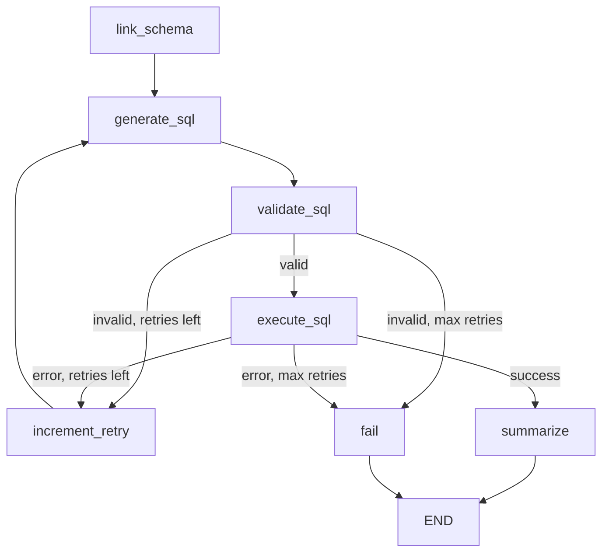

# Text-to-SQL Copilot

Ask business questions in plain English and get answers backed by real PostgreSQL data. Built with **LangGraph**, **FastAPI**, and **PostgreSQL** — designed to be simple to understand, cheap to run, and production-ready.


## What It Does

```
User question → Schema linking → SQL generation → Validation → Execute → Answer
                      ↑                              |
                      └──────── retry (max 2) ───────┘
```

1. **Schema linking** (keyword-based, **no LLM cost**) — picks relevant tables  
2. **SQL generation** (1 LLM call) — produces a read-only `SELECT`  
3. **Validation** — blocks DDL/DML, unknown tables, multi-statements  
4. **Execution** — read-only DB user, timeout, row cap  
5. **Answer** — template-based summary (**no second LLM call**)

## Sample Questions

| Question | What happens |
|----------|--------------|
| What is the total revenue? | Joins `order_items`, sums `quantity * unit_price` |
| How many customers do we have? | `SELECT COUNT(*) FROM customers` |
| Top 3 products by quantity sold | Groups by product, orders by quantity |
| Revenue by country | Joins customers → orders → order_items |

## Tech Stack

| Layer | Choice |
|-------|--------|
| API | FastAPI + Uvicorn |
| Agent | LangGraph `StateGraph` |
| Database | PostgreSQL 16 |
| LLM (local) | Ollama + llama3.2 (**$0**) |
| LLM (cloud) | Groq + llama-3.1-8b-instant (**free tier**) |
| Validation | sqlparse |

## Cost Optimization

This project is intentionally cheap to run:

| Technique | Savings |
|-----------|---------|
| Keyword schema linking | 0 LLM tokens (vs. sending full schema every time) |
| Pruned schema in prompt | ~70% fewer input tokens |
| Single LLM call per attempt | No separate "intent" or "summary" calls |
| Template-based answers | 0 tokens for result formatting |
| `temperature=0`, `max_tokens=512` | Predictable, short outputs |
| Max 2 retries | Caps worst-case at 3 LLM calls per question |
| **Response cache (TTL)** | **0 LLM + 0 DB on repeated questions** |
| Ollama locally | Completely free |

**Typical cost per question (Groq free tier):** 1 LLM call ≈ 500–800 tokens → well within free limits. Repeated questions within the TTL cost **nothing**.

## Query Caching

Repeated questions skip the agent entirely:

```
POST /query "What is total revenue?"  →  LLM + DB  →  stored in cache
POST /query "what is total revenue?"  →  cache hit  →  instant, $0
```

| Setting | Default | Purpose |
|---------|---------|---------|
| `CACHE_ENABLED` | `true` | Toggle caching |
| `CACHE_TTL_SECONDS` | `300` | Entry lifetime (5 min) |
| `CACHE_MAX_SIZE` | `256` | Max cached questions |

- Keys are normalized (case/whitespace insensitive)
- Only **successful** responses are cached (valid SQL + answer)
- Bypass with header: `X-Cache-Bypass: true`
- Clear after data changes: `DELETE /api/v1/cache`
- Stats: `GET /api/v1/cache/stats`

> On Render free tier, cache is in-process (resets on deploy/cold start). For multi-instance production, swap in Redis — the interface is isolated in `app/services/query_cache.py`.

## Project Structure

```
text-to-sql-copilot/
├── app/
│   ├── main.py              # FastAPI app + static UI
│   ├── config.py            # Pydantic settings
│   ├── agents/
│   │   ├── graph.py         # LangGraph workflow
│   │   ├── nodes.py         # Node functions
│   │   ├── state.py         # Typed agent state
│   │   └── runner.py        # Entry point
│   ├── api/
│   │   ├── routes.py        # /health, /query
│   │   └── schemas.py       # Request/response models
│   ├── db/
│   │   ├── engine.py        # Async SQLAlchemy
│   │   └── schema.py        # Tables + seed data
│   ├── services/
│   │   ├── schema_service.py
│   │   ├── sql_validator.py
│   │   └── query_executor.py
│   ├── llm/
│   │   └── factory.py       # Ollama / Groq factory
│   └── static/
│       └── index.html       # Chat UI
├── scripts/
│   ├── init_db.py           # Local DB setup
│   └── docker-init.sql      # Docker/Neon schema + seed
├── tests/
├── docker-compose.yml
├── Dockerfile
├── render.yaml              # Render.com blueprint
└── requirements.txt
```

## Quick Start (Local)

### Prerequisites

- Python 3.12+
- PostgreSQL 16 (or use Docker)
- [Ollama](https://ollama.com/) with `llama3.2` (recommended for free local LLM)

### 1. Clone & install

```bash
cd text-to-sql-copilot
python -m venv .venv
source .venv/bin/activate
pip install -r requirements.txt
cp .env.example .env
```

### 2. Start PostgreSQL

**Option A — Docker (easiest):**

```bash
docker compose up db -d
```

**Option B — existing Postgres (or re-seed Docker DB):**

```bash
# Reads DATABASE_ADMIN_URL from .env automatically
python scripts/init_db.py
```

> If you used `docker compose up db`, the schema is already created — you only need `init_db.py` to **re-seed** data. The script is safe to re-run.

### 3. Start Ollama

```bash
ollama pull llama3.2
ollama serve   # if not already running
```

### 4. Run the app

```bash
make dev
# or: uvicorn app.main:app --reload --port 8000
```

Open **http://localhost:8000** for the web UI, or **http://localhost:8000/docs** for Swagger.

### Web UI features

- Chat-style query composer with sample questions
- Live health status (DB + LLM provider)
- Schema reference sidebar
- SQL display with copy button
- Sortable results table
- Query history (localStorage)
- Cache bypass toggle + clear cache
- Fully responsive (mobile-friendly)

### 5. Try the API

```bash
curl -X POST http://localhost:8000/api/v1/query \
  -H "Content-Type: application/json" \
  -d '{"question": "What is the total revenue?"}'
```

## Docker (Full Stack)

Runs Postgres + API. Ollama must run on your host machine:

```bash
ollama pull llama3.2
docker compose up --build
```

App: **http://localhost:8000**

## Production Safeguards

| Safeguard | Implementation |
|-----------|----------------|
| Read-only DB user | `copilot` role with `SELECT` only |
| SQL allowlist | Only `customers`, `products`, `orders`, `order_items` |
| Statement type | `SELECT` only — blocks INSERT/UPDATE/DELETE/DROP |
| Multi-statement block | sqlparse single-statement check |
| Row cap | `LIMIT 100` enforced |
| Query timeout | `statement_timeout = 10s` |
| Retry limit | Max 2 self-correction attempts |
| Input limit | Questions capped at 500 chars |

## LangGraph Workflow



## Cloud Deployment (Free Tier)

Deploy the full stack for **$0/month** using free tiers:

| Service | Free Tier | Role |
|---------|-----------|------|
| [Neon](https://neon.tech) | 512 MB Postgres | Database |
| [Groq](https://console.groq.com) | Free API credits | LLM |
| [Render](https://render.com) | Free web service | API hosting |

### Step 1: Neon PostgreSQL

1. Create a free project at [neon.tech](https://neon.tech)
2. Open the **SQL Editor** and paste the contents of `scripts/docker-init.sql`
3. Run it to create tables, seed data, and the read-only `copilot` user
4. Copy the connection string and convert to async format:
   ```
   postgresql+asyncpg://copilot:changeme@<host>/sales_db?ssl=require
   ```

### Step 2: Groq API Key

1. Sign up at [console.groq.com](https://console.groq.com)
2. Create an API key
3. Model used: `llama-3.1-8b-instant` (fast, free tier friendly)

### Step 3: Deploy to Render

1. Push this repo to GitHub
2. Go to [render.com](https://render.com) → **New Blueprint**
3. Connect your repo — Render reads `render.yaml`
4. Set environment variables:
   - `DATABASE_URL` → Neon connection string (asyncpg format)
   - `GROQ_API_KEY` → your Groq key
5. Deploy

Your app will be live at `https://text-to-sql-copilot.onrender.com` (URL varies).

> **Note:** Render free tier spins down after 15 min inactivity. First request may take ~30s to cold start.

### Alternative: Fly.io

```bash
fly launch --no-deploy
fly secrets set DATABASE_URL="postgresql+asyncpg://..." GROQ_API_KEY="gsk_..."
fly deploy
```

## Environment Variables

| Variable | Default | Description |
|----------|---------|-------------|
| `DATABASE_URL` | local copilot user | Async Postgres URL |
| `LLM_PROVIDER` | `ollama` | `ollama` or `groq` |
| `OLLAMA_BASE_URL` | `http://localhost:11434` | Ollama server |
| `OLLAMA_MODEL` | `llama3.2` | Local model |
| `GROQ_API_KEY` | — | Required for `groq` provider |
| `GROQ_MODEL` | `llama-3.1-8b-instant` | Cloud model |
| `MAX_SQL_RETRIES` | `2` | Self-correction attempts |
| `MAX_RESULT_ROWS` | `100` | Row cap |
| `SQL_TIMEOUT_SECONDS` | `10` | Query timeout |
| `CACHE_ENABLED` | `true` | Cache repeated queries |
| `CACHE_TTL_SECONDS` | `300` | Cache entry TTL (seconds) |
| `CACHE_MAX_SIZE` | `256` | Max cached responses |

## API Reference

### `GET /api/v1/health`

```json
{"status": "ok", "database": "ok", "llm_provider": "ollama"}
```

### `POST /api/v1/query`

**Request:**
```json
{"question": "How many customers are from the USA?"}
```

**Response:**
```json
{
  "question": "How many customers are from the USA?",
  "sql": "SELECT COUNT(*) FROM customers WHERE country = 'USA' LIMIT 100",
  "answer": "Result: **3**",
  "columns": ["count"],
  "rows": [{"count": 3}],
  "relevant_tables": ["customers"],
  "llm_calls": 1,
  "retry_count": 0,
  "cached": false
}
```

### `GET /api/v1/cache/stats`

```json
{"enabled": true, "size": 12, "max_size": 256, "ttl_seconds": 300}
```

### `DELETE /api/v1/cache`

Clears all cached responses. Returns `{"cleared": 12}`.

## Testing

```bash
pip install -r requirements.txt
pytest -v
```

## Interview Talking Points

- **Why LangGraph?** Explicit control flow for validate → retry loops; easy to add human-in-the-loop later  
- **Why keyword schema linking?** Cuts LLM cost and latency; LLM only does what it's best at (SQL generation)  
- **Why read-only user?** Defense in depth — even if validation fails, Postgres permissions block writes  
- **How would you scale?** Connection pooling, Redis cache for repeated questions, pgBouncer, horizontal API replicas  

## License

MIT
